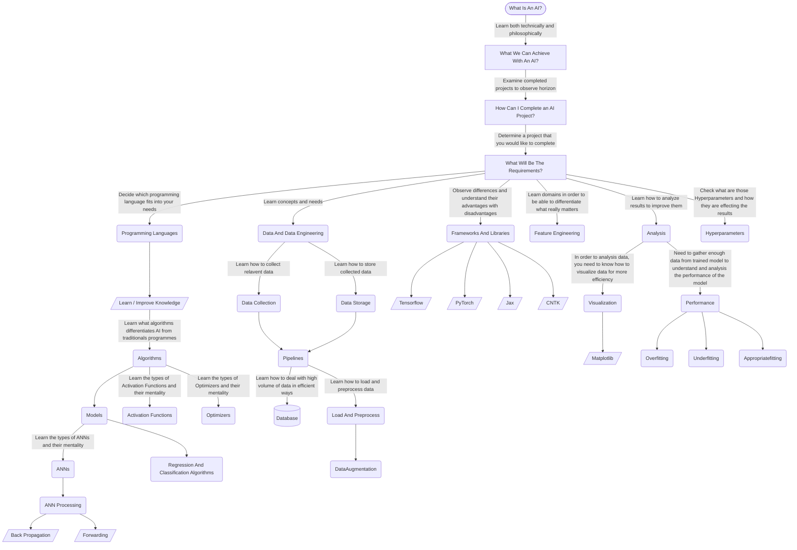

# Greetings, Welcome To 'image_recognition'!
This project has been made to teach people who wants to learn or improve themselfs in the field of AI.

## What Is This Project?
This is a supervised image recognition project that has been completed with 'Tensorflow' & 'Keras' as highlighted technologies.

## What Its Main Purpose?
Teaching & improvement. There are many sources that you can examine and learn AI from them but since this field is improving with a speed of light, sources might get outdated. 

Many of the AI projects to teach basics has been made as small scale project therefore they are easy to understand at first glance but extremely hard to classify into bigger scaled projects. With this project, you will face with well structured architecture for bigger scaled projects. 

At first, it might be little bit excessive and hard to understand, but when you overcome the learning curve, you will love it and will be able to clearly observe the architecure choices that has been made makes your job easier to understand what exactly accomplishes what.

## What Makes This Project Different Than Others?
It is made with known technologies and achive relatively easy task to accomplish. What makes difference is that structure designed very well and we both know how 'Tensorflow' can be tough to understand since it is not 'pythonic'. And well you know, documentations from Google are not helping much either.

Every macro and parameters for AI (Hyperparameters, Models, Optimizers, Load & Preprocess, Input & Output tuning, Future Engineering, Datasets, Activation Functions, etc...) has been defined inside parameter file called 'values.yaml' therefore you can change everything inside the programm from one file, even the dataset, and yes I approached with a 'Repository' design for this project. 

You will able to change everything to observe which model works best with what and when. This will increase your understanding and classification towards processes.

With custom created input pipeline of 'Load & Preprocess' process, you will be able to perform 'Data Engineering' over your project to improve outcomes.

# License
**MIT LICENSE**
Please feel free to change everything to improve anything. Is there something I can do better? Let me know. 

# Learning Path For AI
